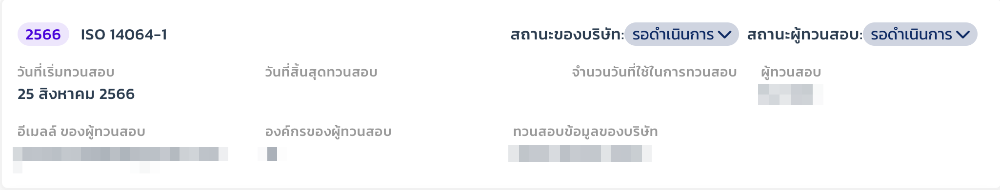

# ทวนสอบข้อมูล

## การ์ดทวนสอบข้อมูล

<figure><figcaption></figcaption></figure>

* แสดงปีที่ทวนสอบข้อมูล
* แสดงสถานะของบริษัทและผู้ทวนสอบ
* แสดงวันที่เริ่ม-สิ้นสุดทวนสอบข้อมูล
* แสดงข้อมูลผู้ทวนสอบ
* สามารถกดเข้าไปในการ์ดเพื่อดูข้อมูลในการทวนสอบได้

## หน้ารายการกิจกรรม

<figure><figcaption></figcaption></figure>

* หน้ารายการกิจกรรมแสดงข้อมูลรายการของบริษัททั้งหมดโดยเรียงตาม scope
* สามารถกดในรายการเพื่อดูข้อมูลเพิ่มเติมของรายการนั้นได้

<figure><figcaption></figcaption></figure>

* เมื่อกดในรายการแล้ว จะแสดงข้อมูลข้อมูลทั้งหมดของแต่ละเดือน และแสดงเปอร์เซ็นความเปลี่ยนแปลงระหว่างปีก่อนหน้ากับปีปัจจุบัน
* สามารถดูเอกสารแนบเพิ่มเติมได้

## หน้าค่าการปล่อยก๊าซเรือนกระจก

<figure><figcaption></figcaption></figure>

* หน้าค่าการปล่อยก๊าซเรือนกระจกแสดงข้อมูลรายการของบริษัททั้งหมดโดยเรียงตาม scope
* สามารถกดปุ่มตามลูกศรเพื่อดูค่า GHG รวม (tCo2eq)&#x20;

<figure><figcaption></figcaption></figure>

* เมื่อกดปุ่มตามลูกศรแล้วจะแสดงค่า GHG รวม (tCo2eq) ของรายการนั้น

## หน้าการแบ่งสัดส่วนองค์กร

<figure><figcaption></figcaption></figure>

* หน้าการแบ่งสัดส่วนองค์กรจะแสดงเปอร์เซ็นการแบ่งสัดส่วนคาร์บอนของแต่ละรายการตาม scope เมื่อแบ่งเปอร์เซ็นแล้ว ผลรวมต้องเท่ากับ 100%

## หน้านัยสำคัญ&#x20;

<figure><figcaption></figcaption></figure>

* หน้านัยสำคัญจะแสดงระดับความมีสาระสำคัญของ scope 1-2 เท่านั้น

<figure><figcaption></figcaption></figure>

* ในส่วนของ scope 3 จะแสดงในเรื่องของแหล่งการปล่อยก๊าซตามรายการที่แสดง ในกรณีที่มีการปล่อยก๊าซตามรายการบริษัทจะต้องใส่คะแนนระดับของแรงจูงใจ, โอกาส หรือความเสี่ยง เพื่อประเมินความเสี่ยง

## หน้าการประเมินความไม่แน่นอน

<figure><figcaption></figcaption></figure>

* หน้าการประเมินความไม่แน่นอนแสดง points ตามเกณฑ์การประเมินของรายการตาม scope นั้น

<figure><figcaption></figcaption></figure>

* เกณฑ์การประเมิน

## รายงานการแก้ไขข้อบกพร่อง

<figure><figcaption></figcaption></figure>

* กด new เพื่อเพิ่มรายงาน
* กรอกข้อมูล ประเด็น&#x20;
* เลือกรายการ ข้อกำหนดที่เกี่ยวข้อง
* เมื่อกดบันทึกรายการจะแสดงในหน้ารายงานการแก้ไขข้อบกพร่อง

<figure><figcaption></figcaption></figure>

* เมื่อมีการตอบกลับจากบริษัทด้วยสถานะ และคำชี้แจ้งแล้ว สามารถบันทึกข้อสรุปของผู้ทวนสอบได้ทันที
