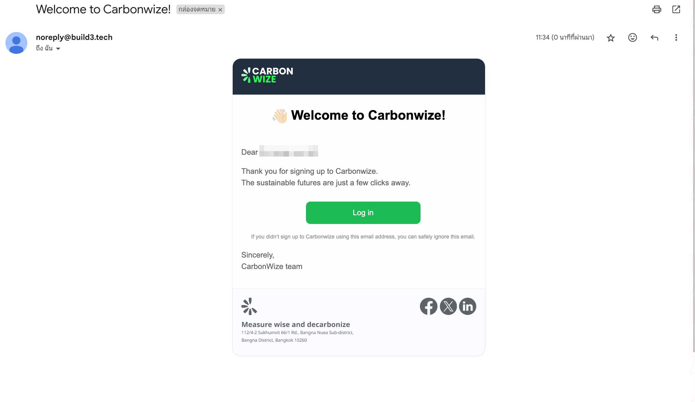

# ขั้นตอนการอนุมัติรายการ

## **ขั้นตอนการอนุมัติรายการ**

<figure><figcaption></figcaption></figure>

1. กดเมนู การอนุมัติรายการ
2. กดแท็บ รออนุมัติ
3. กดเลือกรายการที่ต้องการอนุมัติ

<figure><figcaption></figcaption></figure>

#### ตรวจเช็คข้อมูลรายการ

1. วันที่
2. จำนวน
3. เอกสารประกอบข้อมูล
4. กดปุ่ม อนุมัติ

<figure><figcaption></figcaption></figure>

1. เมื่ออนุมัติรายการเรียบร้อย รายการจะเข้าไปอยู่ในแถบ อนุมัติแล้ว
