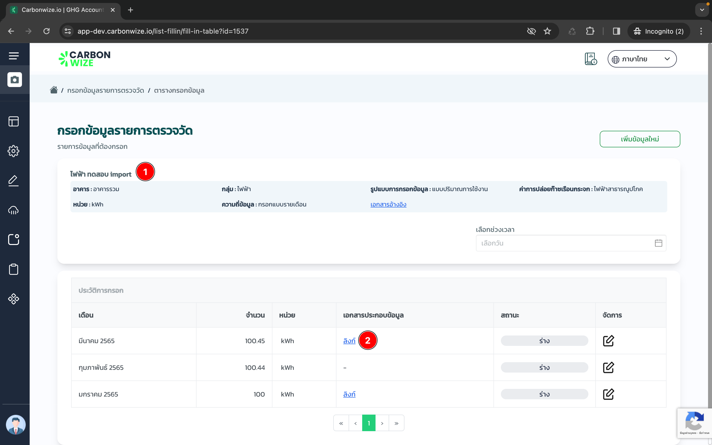

# 🔀 Import data & Bulk import

## Import data

### ขั้นตอนการเตรียมข้อมูลสำหรับการ Import data&#x20;

<figure><figcaption></figcaption></figure>

1. สร้างรายการตรวจวัดเสร็จเรียบร้อย
2. ค้นหารายการที่ต้องการ Import data&#x20;
3. กดปุ่ม Export data&#x20;

<figure><figcaption></figcaption></figure>

#### หลังจาก Export รายการออกมาแล้ว ให้ใส่ข้อมูลให้ครบถ้วนตาม Format ในไฟล์ที่ได้ทำการ Export ออกมา

<figure><figcaption></figcaption></figure>

<figure><figcaption></figcaption></figure>

### **กรุณาอ่านรายละเอียดและกรอกข้อมูลให้ครบถ้วนก่อน Import data**

1. คอลัมน์ **ลำดับ** ให้เรียงลำดับตามช่องบรรทัดไปจนถึงรายการสุดท้าย
2. คอลัมน์ **ID** ให้นำ ID ของรายการตรวจวัดนั้นมาใส่ จะเห็นได้ว่าตอนที่ Export รายการออกมาจะมี ID ใส่มาให้แล้ว สามารถ Copy ID ใส่บรรทัดถัดไปได้เลย
3. คอลัมน์ **บริษัท, สาขา, อาคาร, แผนก, ขอบเขต, หมวดหมู่, ชื่อรายการ, EF, หน่วย, วันที่เริ่มต้นกรอกข้อมูล, รูปแบบในการกรอก, ความถี่ในการกรอก** ให้นำข้อมูลของรายการนั้นมาใส่ จะเห็นได้ว่าตอนที่ Export รายการออกมาจะมี ข้อมูลใส่มาให้แล้ว สามารถ Copy ใส่บรรทัดถัดไปได้เลย
4. คอลัมน์ **วันที่ของบันทึกข้อมูล** ให้ใส่วันที่บันทึกข้อมูล เช่น  01/01/2022 00:00:00 โดย Format ต้องตรงตามตัวอย่าง วันที่บันทึกข้อมูลจะต้องเรียงตามเดือนไม่ข้ามเดือนและไม่สามารถใส่ข้อมูลล่วงหน้าได้
5. คอลัมน์ **ค่าที่ใช้จริง** ให้ใส่ปริมาณค่าที่ใช้จริง
6. คอลัมน์ **ค่ารีเซทมิเตอร์** ใช้ในกรณีที่รูปแบบในการกรอกเป็นแบบสะสมเท่านั้น
7. คอลัมน์ จำนวน (พนักงาน), จำนวน (วัน) ใช้กรอกข้อมูลในรายการของ Septic Tank เท่านั้น
8. คอลัมน์ **kg CO2eq/unit** ไม่ต้องใส่ข้อมูล เนื่องจากเป็นช่องที่ระบบคำนวณ kg CO2eq/unit หากต้องการรู้ปริมาณให้ Import ข้อมูล 1 ครั้ง และ Export ข้อมูลออกมาอีกครั้งจะมีปริมาณ kg CO2eq/unit คำนวณออกมาให้
9. คอลัมน์ **ผู้บันทึกข้อมูล** ให้ใส่ชื่อผู้บันทึกข้อมูล โดยต้องมีชื่อในระบบเท่านั้น
10. คอลัมน์ **วันที่อัปเดตล่าสุด** ให้ใส่วันที่ที่อัปเดตข้อมูล

### ขั้นตอนการ Import data

<figure><figcaption></figcaption></figure>

1. เข้าหน้า กรอกข้อมูลรายการตรวจวัด
2. กดปุ่ม Import data
3. เลือก Import data

<figure><figcaption></figcaption></figure>

1. กดปุ่ม ถัดไป

<figure><figcaption></figcaption></figure>

1. คลิ๊กเพื่อเลือกไฟล์ที่เตรียมไว้สำหรับ Import

<figure><figcaption></figcaption></figure>

1. เลือกไฟล์สำหรับ Import

<figure><figcaption></figcaption></figure>

1. กดปุ่ม ถัดไป

<figure><figcaption></figcaption></figure>

1. Import data สำเร็จ

### ขั้นตอนการตรวจเช็คข้อมูลหลังจาก Import data

<figure><figcaption></figcaption></figure>

1. เข้าหน้ากรอกข้อมูลของรายการตรวจวัดที่ได้ Import data สำเร็จ

<figure><figcaption></figcaption></figure>

1. แสดงชื่อรายการถูกต้อง
2. แสดงข้อมูล เดือน, จำนวน ถูกต้อง
3. สถานะจะแสดงเป็นร่างเท่านั้น สามารถแก้ไข หรือ ส่งคำขออนุมัติ

## Bulk import

### Bulk import คือการอัปโหลดไฟล์เอกสารแนบเข้าในรายการกิจกรรม

<figure><figcaption></figcaption></figure>

#### Bulk import ต้องมีการกรอกข้อมูลไว้ตามเดือนที่ต้องการ Bulk import โดยสถานะข้อมูลต้องเป็นร่าง หากข้อมูลเยอะสามารถทำตามขั้นตอน [Import data](import-and-export.md#import-data)

#### ขั้นตอนการเตรียมข้อมูลสำหรับการ Bulk import&#x20;

<figure><figcaption></figcaption></figure>

#### ขั้นตอนที่ 1 ข้อกำหนดการเตรียม Folder ของรายการกิจกรรม

1. สร้าง Folder ใหม่ โดยชื่อ Folder ต้องมี ID ของรายการกิจกรรมด้านหน้า <mark style="background-color:purple;">สามารถดู ID ของรายการกิจกรรมได้ที่หน้าเว็บ=> เข้าหน้ารายการกิจกรรมนั้น จะมีเลข ID ของรายการกิจกรรมอยู่ที่บนลิงก์ หรือ Export data ของรายการนั้น ในไฟล์ Export จะมีเลข ID ของรายการแสดงอยู่</mark>
2. ชื่อ Folder ต่อจาก ID สามารถใส่ชื่อรายการกิจกรรมเพื่อให้ง่ายกับการเตรียมเอกสารหรือไม่ใส่ก็ได้
3. Folder สำหรับใส่เอกสารต้องเป็น Folder สำหรับใส่เอกสารของรายการนั้นโดยเฉพาะ

<figure><figcaption></figcaption></figure>

#### ขั้นตอนที่ 2 การเตรียม Folder สำหรับใส่เอกสารของรายการนั้น

1. เข้าไปใน Folder ของรายการกิจกรรมที่สร้างไว้ในขั้นตอนที่ 1
2. สร้าง Folder สำหรับใส่เอกสารโดยเรียงตามเดือนที่ต้องการอัปโหลดเอกสารแนบ เช่น 01-01-2022&#x20;
3. เดือนไหนที่ไม่มีเอกสารแนบไม่จำเป็นต้องสร้าง Folder สำหรับใส่เอกสาร

<figure><figcaption></figcaption></figure>

#### ขั้นตอนที่ 3 นำไฟล์เอกสารแนบใส่ใน Folder ตามเดือนที่ต้องการอัปโหลดเอกสาร

1. เข้าไปใน Folder ของเดือนที่ต้องการอัปโหลดเอกสารแนบ ในขั้นตอนที่ 2&#x20;
2. นำเอกสารแนบมาใส่ใน Folder ตามเดือนที่ต้องการอัปโหลดเอกสาร

<figure><figcaption></figcaption></figure>

#### ขั้นตอนที่ 4 เมื่อเตรียม Folder เอกสารแนบเสร็จแล้วให้ทำ Folder เป็นไฟล์ .zip&#x20;

#### <mark style="background-color:purple;">ในการ Bulk import ต้องเป็นไฟล์ .zip เท่านั้น</mark>

### ขั้นตอนการ Bulk import

<figure><figcaption></figcaption></figure>

1. เข้าหน้ากรอกข้อมูลรายการตรวจวัด
2. กดปุ่ม Import data
3. เลือก Bulk import

<figure><figcaption></figcaption></figure>

1. คลิ๊กเพื่อเลือกไฟล์

<figure><figcaption></figcaption></figure>

1. เลือกไฟล์ .zip ที่ได้เตรียมไว้

<figure><figcaption></figcaption></figure>

1. กดปุ่ม ถัดไป

<figure><figcaption></figcaption></figure>

1. Bulk import สำเร็จ

### ขั้นตอนการตรวจเช็คข้อมูลหลังจาก Bulk import

<figure><figcaption></figcaption></figure>

1. เข้าหน้ากรอกข้อมูลของรายการตรวจวัดที่ได้ Bulk import สำเร็จ

<figure><figcaption></figcaption></figure>

<figure><figcaption></figcaption></figure>

1. แสดงชื่อรายการถูกต้อง
2. กดเข้าที่ ลิงก์เอกสารประกอบข้อมูล
3. แสดงไฟล์ที่ได้อัปโหลดเข้าระบบถูกต้อง
